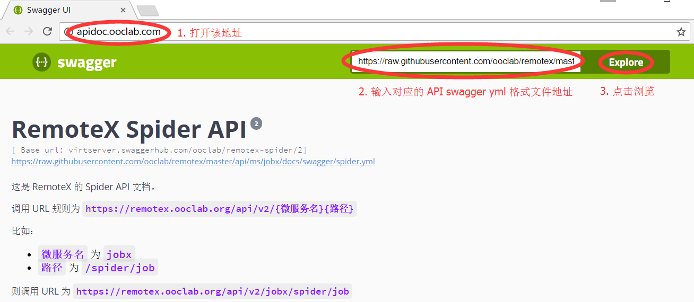

# RemoteX API 文档使用说明

目前 RemoteX API 使用 Swagger 文档。
由于 swagger cloud 免费配额的限制，我们暂时使用 [http://apidoc.ooclab.com](http://apidoc.ooclab.com) 查看 API 文档。

查看API方式如下：

## 步骤

1. 使用浏览器打开 [http://apidoc.ooclab.com](http://apidoc.ooclab.com)
2. 右上角输入框输入 API 对应的 swagger yml 文件地址
3. 点击 "Explore" 开始浏览
