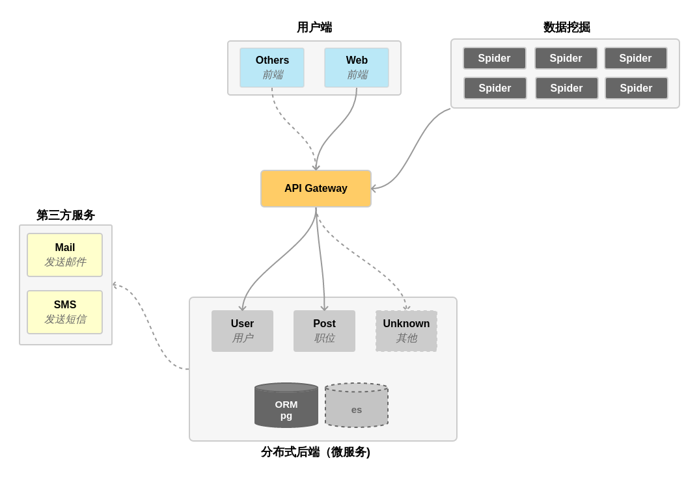

# remotex 架构

## 设计准则

1. 分布式微服务架构(Kong 作为 API gateway)
2. 不限制开发语言：

    - 数据挖掘(spider) 不限制开发使用的语言
    - 后端微服务模块，虽然部分模块使用 [eva (python tornado)](https://github.com/ooclab/eva) 为基础，但允许使用其他语言开发其他微服务模块

## 基本架构

### 用户端

### 数据挖掘

### 微服务

- Kong (API Gateway)
- User 模块( [eva](https://github.com/ooclab/eva) )
